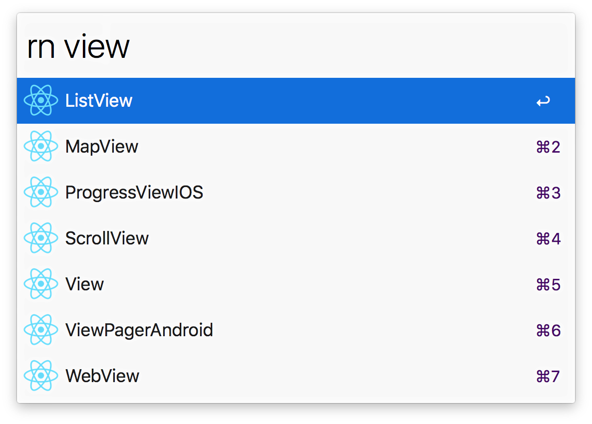

# alfred-react-native
> Alfred 3 workflow to access the React Native Documentation

## Download

Get the workflow from [GitHub](https://github.com/ekonstantinidis/alfred-react-native/releases/latest) or [Packal](http://www.packal.org/workflow/react-native).

Requires **Node.js 4+** and the **Alfred Powerpack**.

## Usage

In Alfred, type rn, Enter, and your query, to search for documentation of components.
Select a component and press Enter to go to its GitHub repo.

## Thanks

Thanks to [sindresorhus](https://github.com/sindresorhus) for making [alfy](https://github.com/sindresorhus/alfy). It works great - made this workflow in 15 minutes.
